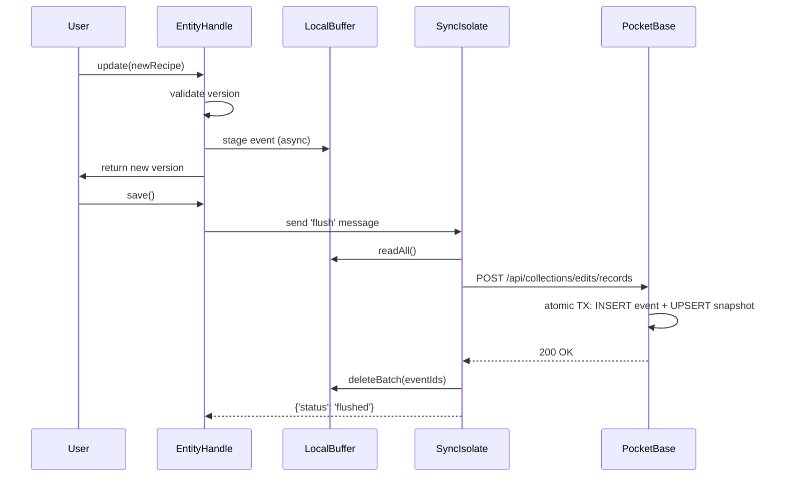

# Event-Sourced Store Architecture

## Overview

MealPlanner uses an event-sourced, offline-first architecture for entity storage. All changes are captured as immutable events, appended to a local buffer, and flushed to PocketBase in batches.

---

## Core Concepts

### UUID Format: 3×64-bit

All entities and events are identified using a **collision-free, time-ordered UUID** in 3 parts:

```
1716283456789:42:902138495737188
│              │   │
│              │   └─ 64-bit device fingerprint (SHA-256 XOR-fold)
│              └───── per-launch counter (increments within same millisecond)
└──────────────────── unix epoch milliseconds
```

**Properties**:
- Sortable by time (lexicographic comparison)
- Device-unique (no PII; hash only)
- Collision-safe across devices
- No network round-trip needed

**Generation**: `final uuid = await UuidGenerator.next();`

---

## Storage Model

### Two Collections in PocketBase

#### `edits` (Append-Only Event Log)

Immutable events describing changes to entities.

| Field | Type | Description |
|-------|------|-------------|
| `id` | text (PK) | Full 3-part UUID |
| `entity_id` | text | First part of UUID (timestamp) |
| `prior_version` | number | Previous event's `next_version` |
| `next_version` | number | Monotonic counter for entity |
| `event_type` | select | CREATE, UPDATE, or DELETE |
| `new_state_json` | json | Full entity state after event |
| `created` | datetime | Auto-timestamp |

**Indexes**: `entity_id`, composite `(entity_id, next_version)`

**Read pattern**: `filter=entity_id="XXX"` + `sort=next_version` → full entity history

#### `snapshots` (Current State Cache)

Mutable cache of the latest entity state for fast reads.

| Field | Type | Description |
|-------|------|-------------|
| `id` | text (PK) | Entity ID prefix (first part of UUID) |
| `version` | number | Latest `next_version` from `edits` |
| `type_version` | text | Schema version string |
| `state_json` | json | Materialized current state |
| `deleted` | bool | Soft-delete flag |
| `latest_handle_version` | number | Concurrency guard |
| `created` | datetime | Auto-timestamp |
| `updated` | datetime | Auto-timestamp |

**List rule**: `deleted = false && @request.auth.id != ''`

---

## Thread Model

### Main Isolate (UI)

```
┌─────────────────────┐
│   Flutter UI Layer  │
│  (Material Widgets) │
└──────────┬──────────┘
           │
┌──────────▼──────────────────────┐
│   EntityHandle<T> (Generic)     │
│  • state: T                      │
│  • version: int                  │
│  • update(newState)              │
│  • save() → triggers isolate     │
│  • undo() / redo()               │
└──────────┬──────────────────────┘
           │
┌──────────▼──────────────────────┐
│    LocalBuffer (In-Memory)       │
│  • append(event)                 │
│  • readAll() → List<StoreEvent>  │
│  • deleteBatch(ids)              │
└─────────────────────────────────┘
```

### Background Sync Isolate

```
┌─────────────────────────────────┐
│  SyncIsolate (Background)       │
│  • Receives 'flush' message     │
│  • Reads from LocalBuffer       │
│  • Batches to PocketBase        │
│  • Handles 409 conflicts        │
│  • Sends messages back          │
└─────────────────────────────────┘
        │
        ├─ Success → notify main
        ├─ 409 Conflict → MergeArbitrator
        └─ Error → log + retry
```

### Message Passing

**Main → Isolate**: 
```dart
syncIsolate.triggerFlush();
// Sends: {'action': 'flush'}
```

**Isolate → Main**:
```dart
mainPort.send({
  'status': 'conflict',
  'entityId': '1716283456789',
  'error': 'divergent histories'
});
```

---

## Lifecycle of One Edit



---

## Offline & Sync Merge

### Divergence Detection

When two devices edit the same entity offline and reconnect:

1. **Local edits** queued in `LocalBuffer`
2. **Sync isolate** tries to POST batch → gets **409 Conflict**
3. **MergeArbitrator** wakes up:
   - Fetch local events from buffer
   - Fetch remote events from PocketBase
   - Find common ancestor by walking `prior_version` links

### Arbitration Strategy

**Winner** = branch with most edits (longest chain)

If tied:
- **Tie-break by timestamp** (first UUID component)
- Newer timestamp wins (device with later clock)

**Loser action**:
- Clear local buffer for that entity
- Show dialog: "Data conflict detected. Restarting to sync latest version."
- Call `exit(0)` (app restart, fetches winning branch)

---

## State Machine

```
┌─────────────┐
│   Offline   │
│  (Buffered) │
└──────┬──────┘
       │ network restored
       ▼
┌─────────────────────┐
│   Sync Isolate      │
│   reads buffer,     │
│   POST to PB        │
└──────┬──────────────┘
       │
   ┌───┴───┐
   │       │
  200    409
   │       │
   ▼       ▼
 ✔     Conflict
    (diverged)
        │
        ▼
┌──────────────────────┐
│ MergeArbitrator      │
│ • Find common        │
│   ancestor           │
│ • Count events       │
│ • Choose winner      │
│ • Rebase loser       │
└──────────┬───────────┘
           │
    ┌──────┴──────┐
    │             │
  Local wins   Remote wins
    │             │
    ▼             ▼
  Sync      Restart & fetch
             winning state
```

---

## EntityHandle<T> API

```dart
// Initialize with existing state
handle.initialize(recipe, version: 5);

// Update (stages event, increments version)
await handle.update(newRecipe);

// Persist staged events to buffer
await handle.save();

// Undo/redo (up to 10 operations)
handle.undo();   // Pop from undo stack
handle.redo();   // Pop from redo stack

// Stage deletion
await handle.delete();

// Getters
print(handle.state);        // Current T
print(handle.version);      // Current version number
print(handle.canUndo);      // bool
print(handle.canRedo);      // bool
```

---

## LocalBuffer Mock Implementation

**For Phase 1**: In-memory `LinkedHashMap<String, String>` (JSON values)

**For Phase 3**: Disk-backed via `dart_record_store` (append-only)

```dart
final buffer = LocalBuffer();  // Singleton

// Append event (JSON serialized)
await buffer.append(event);

// Read all events (insertion order preserved)
final events = await buffer.readAll();

// Delete synced batch
await buffer.deleteBatch(eventIds);

// Size query
print(buffer.size);

// Clear all
await buffer.clear();
```

---

## SyncIsolate Background Worker

Spawned at app startup, listens for flush messages:

```dart
final syncIsolate = await SyncIsolate.spawn();

// Trigger flush (non-blocking)
syncIsolate.triggerFlush();

// Listen for conflicts
syncIsolate.messages.listen((msg) {
  if (msg.type == 'conflict') {
    print('Conflict detected for entity: ${msg.entityId}');
    // Trigger MergeArbitrator
  }
});

// Graceful shutdown
await syncIsolate.shutdown();
```

**Retry Logic**:
- Exponential backoff: 5s, 10s, 20s, max 60s
- Failed batches remain in buffer (will retry on next flush)
- Network errors logged to console

---

## Conflict Resolution (MergeArbitrator)

```dart
final arbitrator = MergeArbitrator(pocketbase: pb);

final result = await arbitrator.resolveConflict(
  entityId: '1716283456789',
  localEvents: bufferedEvents,
);

if (result.status == 'local_wins') {
  print('Local branch is authoritative');
} else if (result.status == 'remote_wins') {
  print('Remote branch wins, app will restart');
  exit(0);
} else {
  print('Conflict resolution failed: ${result.message}');
}
```

---

## Data Privacy

**No PII stored in PocketBase**:
- User identified only by **SHA-256 hash of device ID**
- XOR-folded to 64 bits (third UUID component)
- No email, name, or other user data
- Device ID sourced from:
  - **iOS**: `identifierForVendor` (stable, app-signed)
  - **Android**: `Settings.Secure.ANDROID_ID` (stable, device-wide)
  - **Web/Desktop**: Mock timestamp (not stable; future improvement)

---

## Testing

### Unit Tests

```bash
just test-event-store
```

Tests for:
- `UuidGenerator`: 3-part format, time ordering
- `LocalBuffer`: append, read, delete, clear
- `EntityHandle<T>`: update, undo/redo, version tracking
- `MergeArbitrator`: longest-chain arbitration, timestamp tiebreak
- `StoreEvent` & `EntitySnapshot`: JSON round-trip

### Integration Tests

```bash
just test-offline-sync
```

Tests for:
- Create recipe offline → event buffered
- Undo/redo before save → not persisted
- Buffer maintains insertion order
- Sync isolate receives flush message

---

## Phase Roadmap

### Phase 1 (Current): Core Infrastructure ✅
- [x] 3×64-bit UUID generator
- [x] In-memory LocalBuffer mock
- [x] EntityHandle with undo/redo
- [x] SyncIsolate background worker
- [x] MergeArbitrator (stub)
- [x] Unit + integration tests
- [x] PocketBase edits/snapshots collections

### Phase 2: Flutter UI Integration
- [ ] Migrate Recipe to EntityHandle<Recipe>
- [ ] Undo/redo buttons in recipe editor
- [ ] Offline indicator in status bar
- [ ] Manual conflict testing (2 devices)

### Phase 3: Disk-Backed Buffer
- [ ] Integrate `dart_record_store` (when Dart port done)
- [ ] Run crash-safety tests
- [ ] Verify data survives force-quit mid-flush

### Phase 4: Full Rollout
- [ ] Migrate all entities (MealPlan, ShoppingList)
- [ ] PocketBase JS hook for atomic transactions
- [ ] Performance testing (1000+ events)
- [ ] User acceptance testing

---

## Quota Estimation

### Per-User Storage

Assume:
- 50 recipes × 5KB JSON per event → **250KB**
- 52 weeks of meal plans × 100B per event → **5KB**
- Undo/redo history (10 snapshots) → **50KB**

**Total per user**: ~**300KB** (well below typical CloudKit quota)

**Compression**: JSON can be gzipped to ~40% (future optimization)

---

## References

- **Event Sourcing**: Classic pattern for audit trails and undo/redo
- **CRDT-inspired merge**: Longest-chain + timestamp tie-break (similar to Git)
- **Append-only log**: Ensures crash safety without transactions
- **Local-first**: Works offline, syncs when possible

---

## Troubleshooting

| Problem | Cause | Solution |
|---------|-------|----------|
| Conflicts detected on every sync | Clock skew on devices | Sync device time, use server time if needed |
| LocalBuffer grows unbounded | Sync isolate crashed | Restart app; check logs |
| PocketBase 409 on batch post | Collection doesn't exist | Run `just pocketbase test` to create |
| UUID parse error | Invalid format | Ensure `await UuidGenerator.next()` used |
| Undo stack limited to 10 | By design | Increase `_undoStack.length > 10` threshold if needed |

