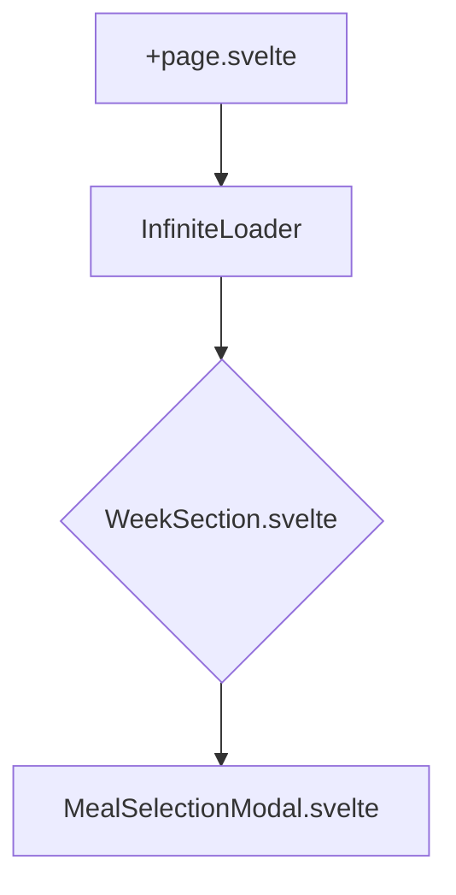
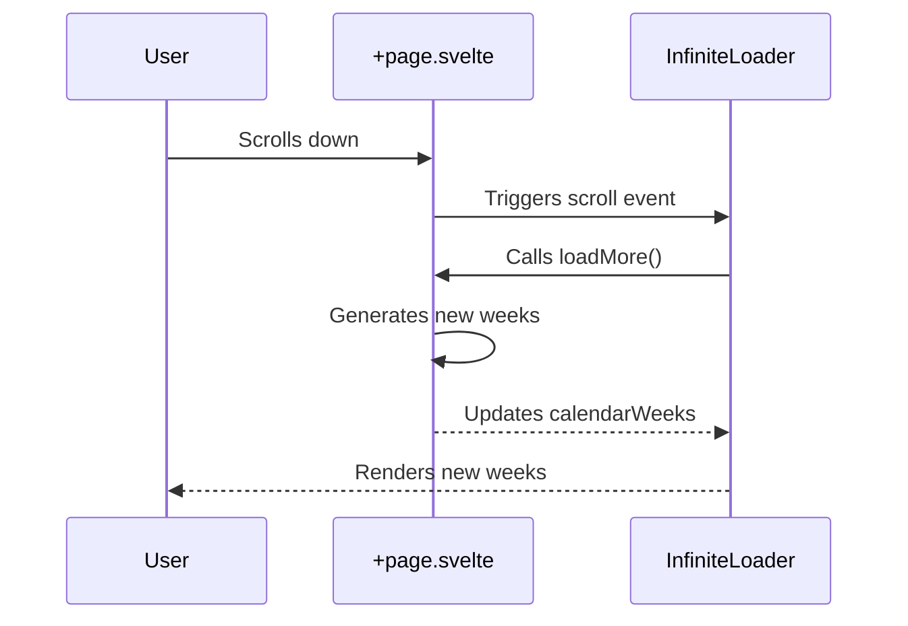
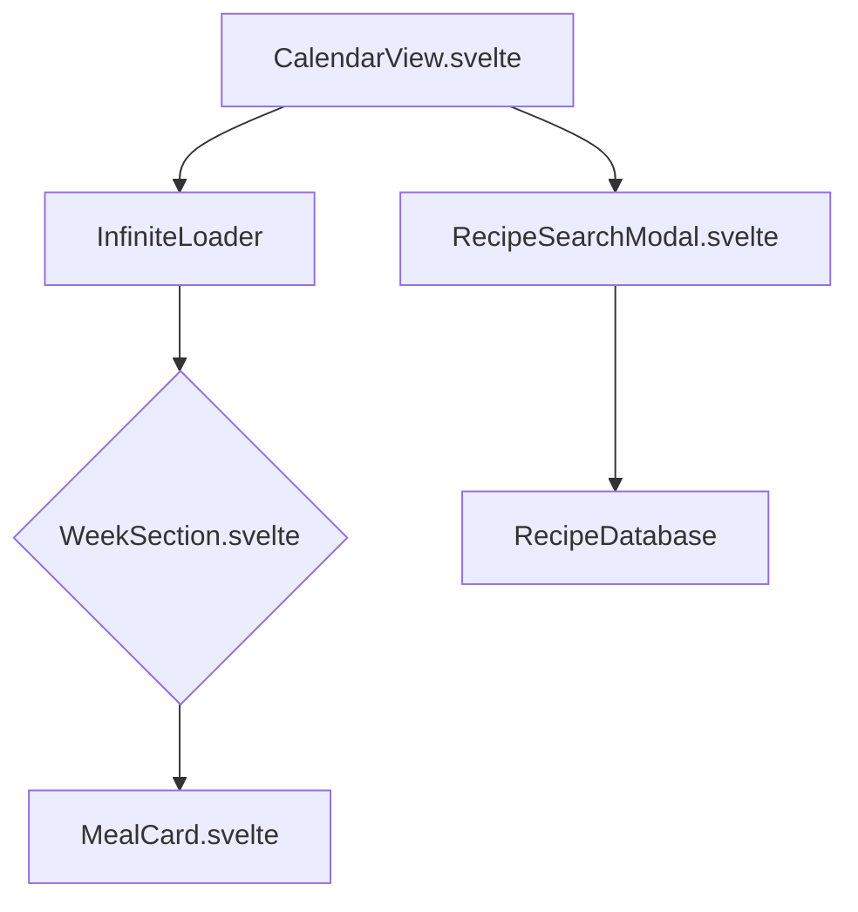

# SvelteKit Architecture for MealPlanner

This document outlines the current architecture of the SvelteKit web application, the proposed final architecture, and the plan for migrating the application to run successfully within a `WKWebView` for the iOS and Android apps.

## 1. Current App Structure

The current application is a SvelteKit-based infinite scroll demo that displays a calendar of weeks. The user can scroll down to load more weeks.

### Component Diagram



- **`+page.svelte`**: The main entry point of the application. It initializes the `InfiniteLoader` and manages the list of weeks.
- **`InfiniteLoader`**: A component that handles the infinite scroll logic. It triggers a `loadMore` function when the user scrolls to the bottom of the page.
- **`WeekSection.svelte`**: Displays a single week in the calendar, including the days and the meals for each day.
- **`MealSelectionModal.svelte`**: A modal dialog that allows the user to select a meal to add to a specific day.

### Sequence Diagram: Loading More Data



## 2. Final App Structure

The final application will integrate the infinite scroll functionality with a fully functional meal planner.

### Component Diagram



- **`CalendarView.svelte`**: Top-level orchestrator, controls navigation and date context.
- **`InfiniteLoader.svelte`**: Core scroll engine, requests additional `WeekSection` blocks as the user scrolls.
- **`WeekSection.svelte`**: Displays a single week; reused from your prior infinite-scroll demo.
- **`MealCard.svelte`**: Displays a single meal within a day slot.
- **`RecipeSearchModal.svelte`**: Allows adding recipes from the embedded recipe DB.
- **`RecipeDatabase`**: The logical backend for managing recipes.

## 3. Logical Backend Integration

The application will use the `@mealplanner/recipe-database` package to manage recipes. This package provides an in-browser database with search functionality, using `localStorage` for persistence.

### Data Structures

The core data structures are `Recipe` and `Ingredient`, defined in the `@mealplanner/recipe-types` package.

**`Ingredient`**
```typescript
export interface Ingredient {
  name: string;
  'ucum-unit': 'cup_us' | 'cup_m' | 'cup_imp' | 'tbsp_us' | 'tbsp_m' | 'tbsp_imp' | 'tsp_us' | 'tsp_m' | 'tsp_imp';
  'ucum-amount': number;
  'metric-unit': 'ml' | 'g';
  'metric-amount': number;
  notes: string;
  'allergen-code'?: 'GLUTEN' | 'CRUSTACEAN' | 'EGG' | 'FISH' | 'PEANUT' | 'SOY' | 'MILK' | 'NUT' | 'CELERY' | 'MUSTARD' | 'SESAME' | 'SULPHITE' | 'LUPIN' | 'MOLLUSC' | 'SHELLFISH' | 'TREENUT' | 'WHEAT';
}
```

**`Recipe`**
```typescript
export interface Recipe {
  title: string;
  image_url: string;
  description: string;
  notes: string;
  pre_reqs: string[];
  total_time: number;
  ingredients: Ingredient[];
  steps: string[];
}
```

### API

The `RecipeDatabase` class provides the following methods for interacting with the recipe data:

- `addRecipe(recipeData: unknown): { success: boolean; recipe?: Recipe; errors: string[] }`: Adds a new recipe to the database.
- `getAllRecipes(): Recipe[]`: Returns all recipes.
- `getRecipeByTitle(title: string): Recipe | undefined`: Retrieves a recipe by its title.
- `searchRecipes(options: SearchOptions): SearchResult[]`: Searches for recipes based on various criteria.

### Integration with the UI

The `RecipeSearchModal.svelte` component will use the `RecipeDatabase.searchRecipes()` method to find recipes. When a user selects a recipe, it will be added to the calendar view.

## 4. Future Direction: Native Storage and Sync

For a more robust and seamless user experience, the application will eventually move from `localStorage` to native storage solutions, with iCloud sync.

- **Native Storage:** The iOS app will use **SwiftData** to store recipes natively on the device. The Android app will use a similar native storage solution.
- **iCloud Sync:** SwiftData provides out-of-the-box support for iCloud sync, allowing users to keep their meal plans synchronized across all their Apple devices.
- **Web Worker Sync:** To keep the `WKWebView` in sync with the native database, a web worker can be used to run a synchronization process in the background. The web worker will communicate with the native side through the JavaScript bridge to fetch and update data.

## 5. Migration Recommendation and Plan for WKWebView

To run the SvelteKit application inside a `WKWebView`, we rely on the framework's standard static output instead of a custom inline wrapper. The build emits hashed asset files under `_app/immutable`, and those assets are copied into the native bundle without modification.

### WKWebView Build Strategy

1.  **Static Bundle Generation**: The web app is built with `@sveltejs/adapter-static` (fallback `index.html`, hash router). No post-processing is required: we use the generated `index.html` and `_app/**/*` assets as-is.
2.  **Asset Packaging**: Native wrappers (iOS `WKWebView`, Android `WebViewAssetLoader`, desktop shells) include the entire `apps/web/build` directory so relative requests for `_app/...` resolve correctly.
3.  **Build Verification**: Standard Vite/SvelteKit logging already includes the commit SHA. We rely on native tooling plus `just web-serve` for runtime checks; no additional HTML injection is needed.

### The Plan

1.  **Configure SvelteKit for SPA output:**
    Ensure `svelte.config.js` retains `@sveltejs/adapter-static` with `fallback: 'index.html'` and hash-based routing so navigation works under `file://` and embedded servers.
2.  **Bundle**: Run `just web-bundle` (delegates to `npm --prefix apps/web run build`). This populates `apps/web/build` with the production assets.
3.  **Serve & Verify**: Use `just web-serve` locally (or Kapture/Playwright) to confirm the build renders correctly before copying it into the native projects.

    - `fallback: 'index.html'`: Ensures all routes are handled by the single `index.html` file.
    - `output: { bundleStrategy: 'inline' }`: Inlines the JavaScript and CSS into the `index.html` file.
    - `router: { type: 'hash' }`: Uses hash-based routing, which is necessary for client-side routing in a `file://` environment.

2.  **Keep Vite lean:**
    The default Vite config with Tailwind and SvelteKit is sufficient. Avoid extra bundling steps—no manual asset inlining or HTML rewriting is required.

3.  **Client-only code path:**
    Remove/avoid server-only modules (`+page.server.ts`, `+server.ts`) in the embedded app so the static build remains self-contained.

### Preserve InfiniteLoader Behavior

- Do not pre-render or prerender routes that dynamically extend the calendar.
- `InfiniteLoader` must run purely client-side; ensure `ssr=false` for its route or in `+layout.ts`.
- For WKWebView SPA mode, the infinite scrolling will continue to work if all scroll logic runs inside `onMount` and doesn’t rely on module-level fetches.

By following this plan, the standard SvelteKit static build can be copied directly into a `WKWebView` or `WebView` bundle without any downstream HTML rewriting.
