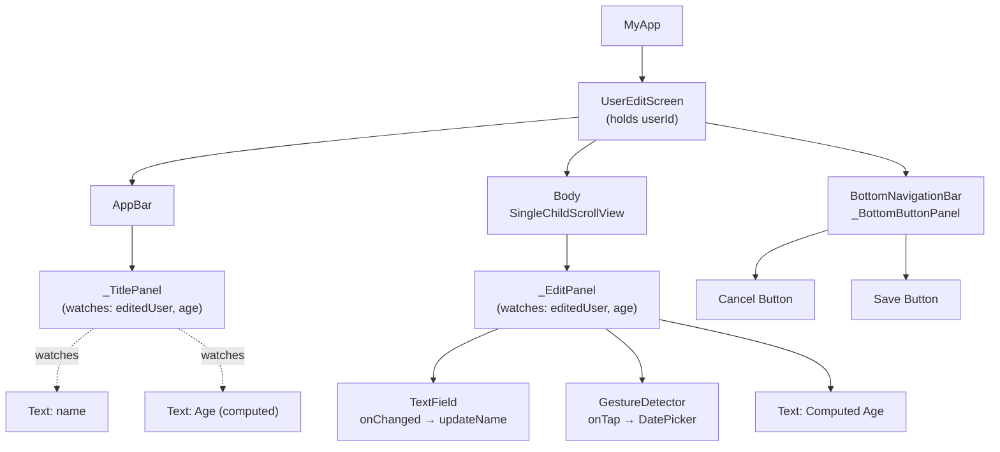
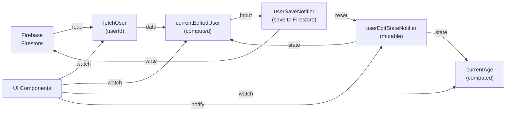
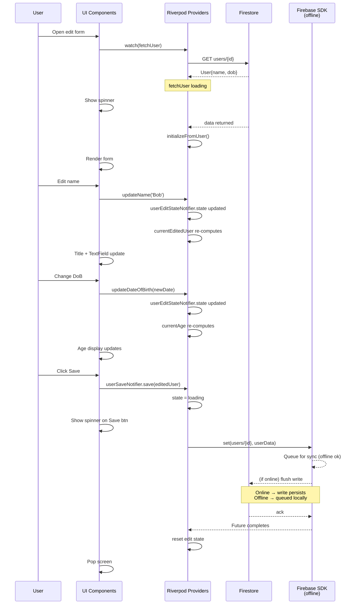
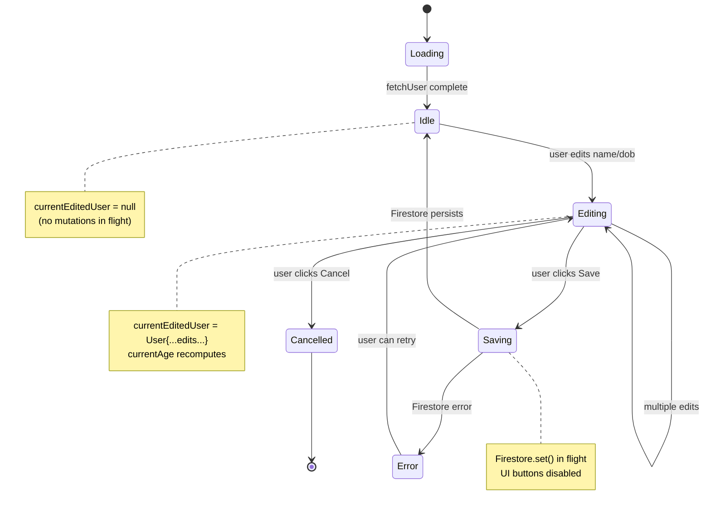
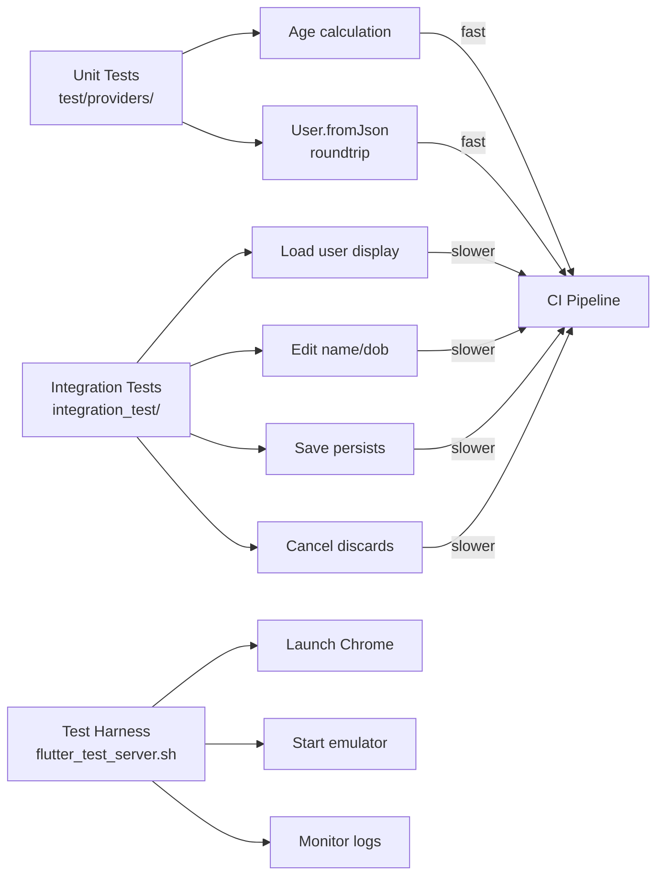

# User Edit Form: Diagrams

## Component Tree



---

## Riverpod Provider Dependency Graph



---

## State Flow: User Interaction Sequence



---

## Edit State Machine



---

## Data Flow: Component Updates

```mermaid
graph TB
    State["userEditStateNotifier<br/>UserEditState"]
    
    State -->|name: String| Derived1["currentEditedUser<br/>User"]
    State -->|dateOfBirth: DateTime| Derived1
    
    Derived1 -->|extracted| Derived2["currentAge<br/>int"]
    
    Derived1 --> Title["_TitlePanel"]
    Derived1 --> EditPanel["_EditPanel"]
    Derived2 --> Title
    Derived2 --> EditPanel
    
    Title --> TitleText["AppBar Title<br/>name + age"]
    EditPanel --> NameInput["Name TextField"]
    EditPanel --> DoBDisplay["DoB Picker Display"]
    EditPanel --> AgeText["Computed Age Label"]
    
    User["User Input"]
    User -->|enters text| NameInput
    NameInput -->|onChanged| UpdateName["updateName()"]
    UpdateName -->|setState| State
    
    User -->|taps picker| DoBDisplay
    DoBDisplay -->|picks date| UpdateDoB["updateDateOfBirth()"]
    UpdateDoB -->|setState| State
    
    State -.watches.-> TitleText
    State -.watches.-> AgeText
    
    Note right of Title
        Stateless + ConsumerWidget
        Re-renders on watched provider change
    End Note
```

---

## Firebase + Offline Sync (Under the Hood)

```mermaid
graph TB
    subgraph App["Flutter App"]
        UI["User Edit Screen"]
        Riverpod["Riverpod"]
    end
    
    subgraph Firebase["Firebase SDK"]
        Local["Local Cache<br/>SQLite on Device"]
        Queue["Write Queue<br/>(offline buffer)"]
    end
    
    subgraph Backend["Firestore Backend"]
        Cloud["Cloud Firestore"]
    end
    
    UI -->|set(user)| Riverpod
    Riverpod -->|set() call| Firebase
    
    Firebase -->|Always<br/>persists locally| Local
    Firebase -->|Queues if offline| Queue
    
    Local -.reads from.-> UI
    
    Firebase -->|if online| Cloud
    Cloud -->|ack| Firebase
    Firebase -->|clears queue| Queue
    
    Note over Firebase
        Firebase SDK handles all sync logic
        App just calls await set()
        Returns when write is accepted
        (queued or persisted)
    End Note
```

---

## Testing Flow


