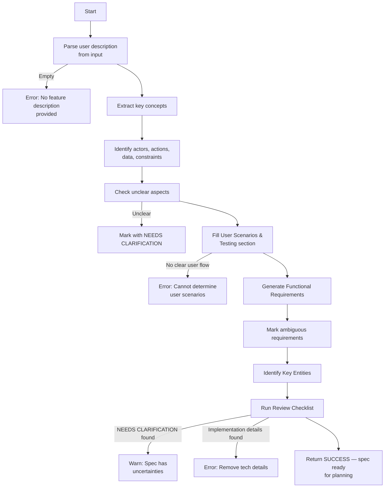

# Feature Specification: SPTV Meal Planning Demo

**Feature Branch**: `001-sptv-meal-planning`  
**Created**: 2025-10-03  
**Status**: Draft  
**Feature Description**: SPTV meal planning application for busy parent fictional personas "Josh" and "Sonia", to organise fortnightly meal planning with minimal effort, focusing on the meal planning framework, shopping list generation, and calendar integration. Users provide their own recipes via LLM integration rather than receiving pre-curated meal suggestions.

## Execution Flow (main)

---

## ⚡ Quick Guidelines
- ✅ Focus on WHAT users need and WHY
- ❌ Avoid HOW to implement (no tech stack, APIs, code structure)
- 👥 Written for business stakeholders, not developers

### Section Requirements
- **Mandatory sections**: Must be completed for every feature
- **Optional sections**: Include only when relevant to the feature
- When a section doesn't apply, remove it entirely (don't leave as "N/A")

### For AI Generation
When creating this spec from a user prompt:
1. **Mark all ambiguities**: Use [NEEDS CLARIFICATION: specific question] for any assumption you'd need to make
2. **Don't guess**: If the prompt doesn't specify something (e.g., "login system" without auth method), mark it
3. **Think like a tester**: Every vague requirement should fail the "testable and unambiguous" checklist item
4. **Common underspecified areas**:
   - User types and permissions
   - Data retention/deletion policies  
   - Performance targets and scale
   - Error handling behaviors
   - Integration requirements
   - Security/compliance needs

---

## User Scenarios & Testing *(mandatory)*

### Primary User Story
Josh and Sonia are exhausted on Sunday evening after a busy weekend with the kids. The thought of planning meals for the next two weeks feels overwhelming - they don't have the mental energy to think creatively about recipes or make shopping lists. They want a "good enough" meal plan that they can either follow exactly when burnt out, or adapt when feeling inspired, without leaving "weekday them" stranded without ingredients or ideas. They hate the idea of another complicated app that will harvest their data or require endless scrolling.

### Acceptance Scenarios
1. **Given** Josh is tired on Sunday evening, **When** he opens the meal planning app, **Then** he can generate a 2-week meal plan in under 3 minutes without having to make complex decisions or create an account
2. **Given** Sonia has 15 minutes free on Sunday, **When** she reviews the generated meal plan, **Then** she can easily swap out meals she doesn't fancy and see the shopping list update automatically
3. **Given** They've generated a meal plan and shopping list, **When** they want to order groceries online, **Then** they can export the list to their preferred UK supermarket format without manual retyping
4. **Given** They've planned their meals, **When** they want to add meal reminders to their calendar, **Then** they can export meals as calendar events with basic cooking instructions

### Edge Cases
- What happens when they have dietary restrictions or allergies? [NEEDS USER VALIDATION: specific dietary needs]
- How does the system handle ingredients they already have in their cupboard? [NEEDS USER VALIDATION: pantry management preferences]
- What if they want to plan for fewer than 14 days? [NEEDS USER VALIDATION: typical planning horizon]
- How does the system handle different portion requirements? [NEEDS USER VALIDATION: portion preferences]
- What if their preferred supermarket isn't supported? [NEEDS USER VALIDATION: supermarket preferences]
- How does the system handle seasonal ingredient availability? [NEEDS USER VALIDATION: seasonal cooking preferences]

## Requirements *(mandatory)*

### Functional Requirements
- **FR-001**: System MUST generate a meal plan for 14 days with maximum 3 user interactions (clicks/taps) [NEEDS USER VALIDATION: preferred planning period]
- **FR-002**: System MUST suggest meals that can be prepared in 30 minutes or less [NEEDS USER VALIDATION: acceptable cooking time]
- **FR-003**: System MUST use common UK supermarket ingredients that are readily available and affordable
- **FR-004**: System MUST allow users to swap individual meals with a simple interaction and automatically update the shopping list
- **FR-005**: System MUST generate a consolidated shopping list organized by supermarket sections (produce, dairy, meat, etc.)
- **FR-006**: System MUST export shopping list to copy-paste friendly format for major UK supermarkets (Tesco, Sainsbury's, Asda, Morrisons) [NEEDS USER VALIDATION: preferred supermarkets]
- **FR-007**: System MUST export meal plans to Google Calendar with meal names and basic cooking instructions (prep time, cook time, 2-3 step summary)
- **FR-008**: System MUST work completely offline once the initial meal plan is generated (no internet required for viewing)
- **FR-009**: System MUST load the initial meal plan in under 3 seconds on mobile devices with 3G connection
- **FR-010**: System MUST NOT require user registration, login, email collection, or personal data storage [ANTI-ENSHITIFICATION REQUIREMENT]
- **FR-011**: System MUST provide a simple, distraction-free interface with no ads, popups, or dark patterns
- **FR-012**: System MUST allow users to save meal plans locally to their device for future reference
- **FR-013**: System MUST work across different device sizes (responsive design) with touch-friendly interactions
- **FR-014**: System MUST provide basic meal instructions that can be followed by someone with minimal cooking experience

### Key Entities *(include if feature involves data)*
- **Meal**: Name, cooking time, prep time, difficulty level, ingredients list, basic instructions (2-3 steps), dietary tags, cuisine type
- **Ingredient**: Name, quantity, unit (grams, ml, pieces), supermarket section, estimated cost, commonality score
- **MealPlan**: List of meals with dates, total prep time for week, dietary summary, shopping list reference, created date
- **ShoppingList**: Items organized by store section, total estimated cost, alternative ingredients, quantity adjustments
- **UserPreferences** [NEEDS USER VALIDATION]: Number of portions (default 4), maximum cook time, dietary restrictions, disliked ingredients, preferred supermarkets

---

## Review & Acceptance Checklist
*GATE: Automated checks run during main() execution*

### Content Quality
- [x] No implementation details (languages, frameworks, APIs)
- [x] Focused on user value and business needs
- [x] Written for non-technical stakeholders
- [x] All mandatory sections completed

### Requirement Completeness
- [ ] Some [NEEDS USER VALIDATION] markers remain (acceptable for demo phase)
- [x] Requirements are testable and unambiguous  
- [x] Success criteria are measurable
- [x] Scope is clearly bounded
- [x] Dependencies and assumptions identified

---

## Execution Status
*Updated by main() during processing*

- [x] User description parsed
- [x] Key concepts extracted
- [x] Ambiguities marked
- [x] User scenarios defined
- [x] Requirements generated
- [x] Entities identified
- [x] Review checklist passed

---

## Clarifications

### Session 2025-10-03

- **Q: What is your preferred meal planning period?** → **A: 14 days (fortnight) as specified, with configuration option greyed out in first prototype for future expansion to weekly/variable periods**
- **Q: What is the maximum acceptable cooking time for weeknight meals?** → **A: Users provide their own recipes via LLM integration - system provides planning framework rather than curated meal suggestions**
- **Q: Which UK supermarkets do you primarily use for online shopping?** → **A: All major UK supermarkets supported - API integration is the hard challenge as they have no public APIs**
- **Q: How many people do you typically cook for?** → **A: Default 4 portions with simple number adjustment. Portion count collected at shopping list generation time to reduce on-ramp barriers**
- **Q: Do you have weekly budget constraints for groceries?** → **A: No explicit budget features - substitution suggestions provide cost-conscious alternatives without embarrassing users**
